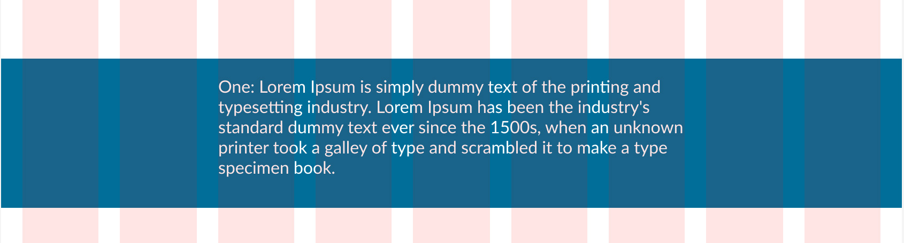
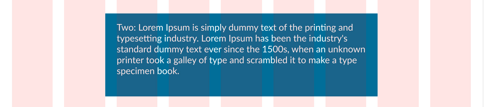
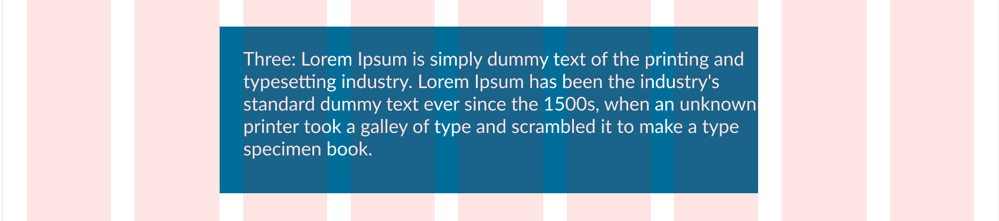
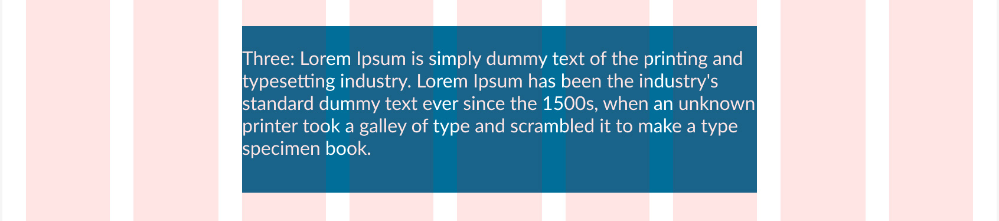

# Layout Patterns & Grid Intent Specification

_(Human- and AI-readable)_

## Purpose

This document defines a shared vocabulary and intent model for layout using a column-based grid.

Its goal is to eliminate ambiguity when expressing layout requirements—especially in cases where **content width** and **background containment** differ.

This specification is intended to be used by:

- designers
- frontend developers
- AI coding assistants

---

## 1. Grid Foundations (Structural Grid)

All layouts are built on a **structural content grid**.

**Baseline grid (example configuration):**

- Columns: 9
- Outer margins: 20px
- Gutters: 20px
- Content aligns to **column tracks**
- Grid lines define column boundaries

> The grid defines **alignment and rhythm**, not background containment.

---

## 2. Key Distinction: Content vs Panel

Every layout element must be described using **two independent dimensions**:

### A. Content Span

- How many columns the _content_ (text, images, media) occupies
- Expressed in columns or grid lines
- Example: “content spans 5 columns”

### B. Panel (Background) Containment

- How far the background color or panel extends relative to the content
- Expressed using **named panel patterns** (defined below)

> Backgrounds are never assumed to match content width by default.

---

## 3. Named Panel Patterns

All background treatments must use one of the following named patterns (or explicitly define a new one).

Each pattern includes **example intent language**, which demonstrates how the pattern might be referenced in a prompt or specification.
The numbers used in examples are illustrative only.

---

### Pattern 1: Full-Bleed Band

**Description**

- Content spans N columns
- Background spans the full grid width (margin to margin)

**Example intent language**

> “Full-bleed band; content spans 5 columns (columns 3-7)”

**Use cases**

- section dividers
- hero bands
- strong visual emphasis

**Screenshot Example**

We would say that this is a full-bleed band with content spanning 5 columns from column 3 to 7.

---

### Pattern 2: Contained Panel (Symmetric)

**Description**

- Content spans N columns
- Background spans the same columns **plus equal inner padding** on both sides

**Example intent language**

> "Contained panel with symmetric padding; content spans 5 columns (columns 3–7)."

**Use cases**

- cards
- callouts
- readable text panels

**Screenshot Example**


---

### Pattern 3: Asymmetric Panel

**Description**

- Content spans N columns
- Background extends beyond content on one side only
- Opposite edge is flush with the content edge

**Example intent language**

> “Asymmetric panel with leading offset: background extends left of the content and is flush on the right. Content spans 5 columns (columns 3–7).”

**Notes**

Directionality must always be specified (leading vs trailing)

- leading offset: background extends before the content
- trailing offset: background extends after the content

**Use cases**

- editorial layouts
- directional emphasis
- visual anchoring

**Screenshot Example**


---

### Pattern 4: Tight Panel

**Description**

- Background aligns exactly with content edges
- No additional horizontal padding beyond typographic needs

**Example intent language**

> “Tight panel aligned exactly to content edges”

**Use cases**

- labels
- badges
- compact emphasis blocks

**Screenshot Example**


---

## 4. Expressing Layout Intent (Required Practice)

Every layout instruction must specify **both**:

1. **Content span**
2. **Panel pattern**

Optional parameters (padding amount, gutter offsets, directionality) should be included when relevant.

### Example

```text
Grid: 9 columns
Content span: 5 columns (columns 3–7)
Panel pattern: Asymmetric
Panel behavior:
  - leading edge: extends 1 gutter beyond content
  - trailing edge: flush with content
```

This eliminates positional guesswork and avoids layout “fixes” using offsets or pseudo-elements.

---

## Implementation Guidance (Non-Normative)

- Prefer native layout mechanisms (CSS Grid, container padding)
- Avoid pseudo-elements (`::before`, `::after`) for panel sizing unless explicitly required
- Do not use positional offsets to simulate grid alignment

> If a layout cannot be expressed using **content span + panel pattern**, the intent is underspecified.

---

## Screenshots & Diagrams (Recommended)

Screenshots are **illustrative**, not normative:

- they clarify intent
- they do not override written definitions
- they should not be used for measurement

---

## Design System Rule

> Grids define alignment.
> Panels define containment.
> They must be specified independently.

---
